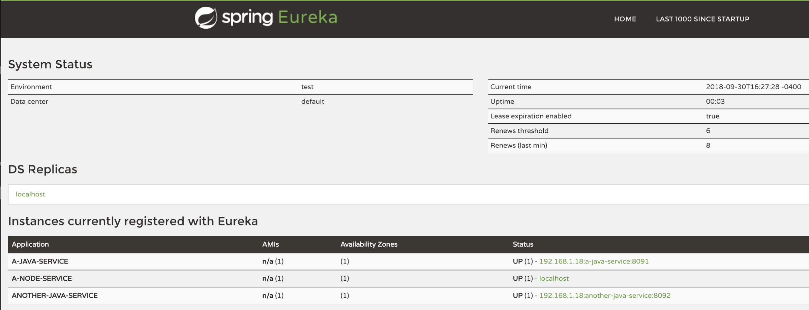

## Java Advanced. Лекция 2.1.2
### Какие нам нужны минимальные настройки, чтобы запустить Eureka Server?


В файле **application.yml (application.properties)**:
```
spring:
    application:
        name: eureka-server

server:
    port: ${PORT:8761}

eureka:
    client:
        registerWithEureka: false
        fetchRegistry: false
    instance:
        hostname: my-eureka-server.com
```
Воспользуйтесь шаблоном. Скачайте код и следуйте инструкциям, представленным в статье. Все необходимые зависимости и версии уже присутствуют в файле **pom.xml**.

https://github.com/IvanCherepica/template/tree/main/eureka-client

Вам остаётся только написать код.

#### Это базовые настройки.
Немного поясню:

первые строки понятны, указываем имя и порт для сервера.

С остальными строками немного сложнее. Давайте разберемся с ними.

Так как мы не хотим, чтобы наш сервер Eureka зарегистрировался сам с собой, мы установили свойство

`registerWithEureka: false`

Если мы не хотим чтобы клиент получал информацию реестра от Eureka Server, нам надо указать следующее:
```
eureka:
    client:
        fetchRegistry: false
```
Свойство
```
instance:
    hostname: my-eureka-server.com
```
особенно важно, поскольку мы запускаем его на локальном компьютере.

Также необходимо указать соответствующую аннотацию @EnableEurekaServer в основном файле проекта
```
@SpringBootApplication
@EnableEurekaServer
public class eureka-server.src.main.java.EurekaServerApplication {
    public static void main(String[] args) {
        SpringApplication.run(eureka-server.src.main.java.EurekaServerApplication.class, args);
    }
}
```
Теперь нужно создать новый проект со следующими зависимостями:

**Eureka Server**, **Spring Web**, **Artifact** и name проекта: **eureka-server**.

Это и есть минимальные необходимые настройки для запуска Eureka Server. С этими настройками ваш сервер запустится и будет ждать пока другие сервисы зарегистрируются в нем.

#### Давайте протестируем.
Запустите проект и перейдите по адресу (по умолчанию использует порт 8761)

http://localhost:8761

Вы увидите веб интерфейс, в котором можно получить всю необходимую информацию по микросервисам зарегистрированным в Eureka Server.

